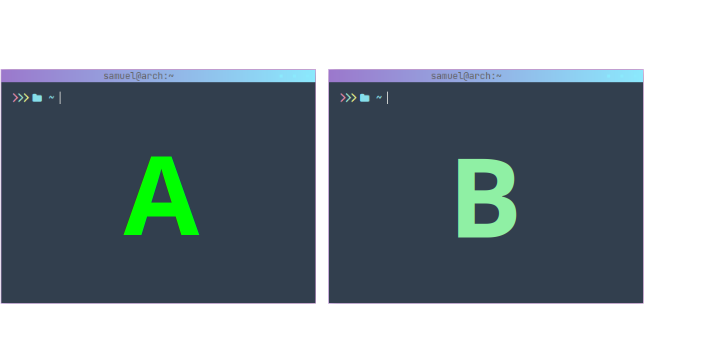
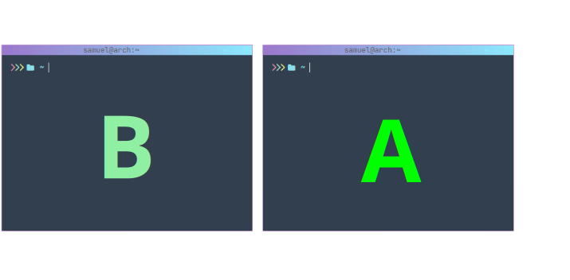

# Expected behaviour of the program

|         command        | focus change |
|------------------------|--------------|
| `change_window --left` |   nothing    |
| `change_window --right`|  A &rarr; B  |
| `change_window --up`   |   nothing    |
| `change_window --down` |   nothing    |

---

|         command        | focus change |
|------------------------|--------------|
| `change_window --left` |  A &rarr; B  |
| `change_window --right`|   nothing    |
| `change_window --up`   |   nothing    |
| `change_window --down` |   nothing    |

---
